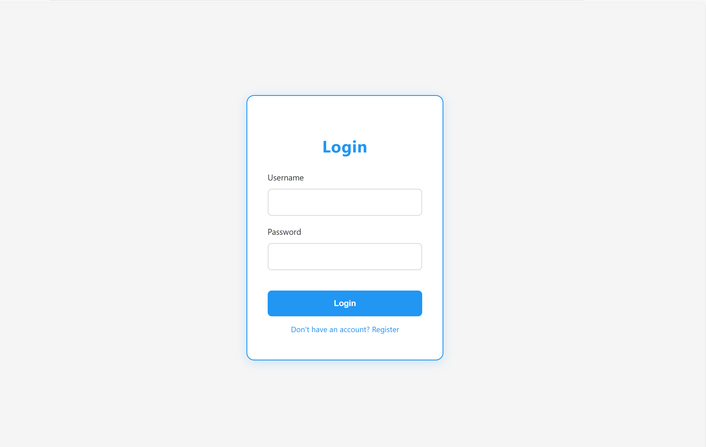
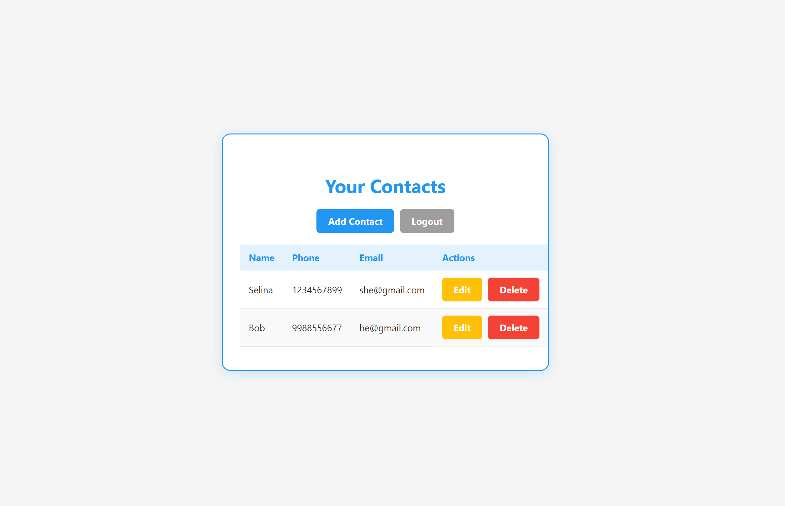
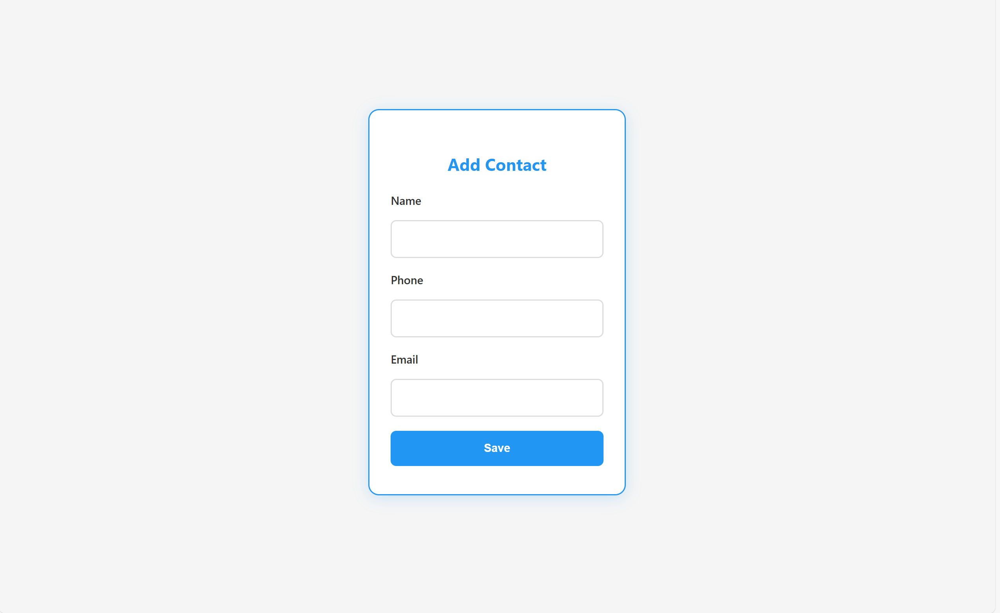

# Flask Contact Book App

A simple contact book web application built with Flask and Python that allows users to register, log in, and manage their personal contacts. The app supports full CRUD (Create, Read, Update, Delete) operations for contacts and user authentication.

## Features

- User registration and login with Flask-Login
- Secure password hashing with Werkzeug
- Add, view, edit, and delete contacts
- Each user sees only their own contacts
- Email validation in forms
- Flash messages for user feedback
- SQLite database with SQLAlchemy ORM

## Technologies Used

- Python 3.x
- Flask
- Flask-Login
- Flask-WTF
- Flask-SQLAlchemy
- WTForms
- SQLite

## Installation

1. **Clone the repository:**

   ```bash
   git clone https://github.com/Kaur7611/contact-book.git
   cd contact-book

## **Screenshots**

### Login Page  


### Home Page  


### Add Contact  


### Edit Contact  

