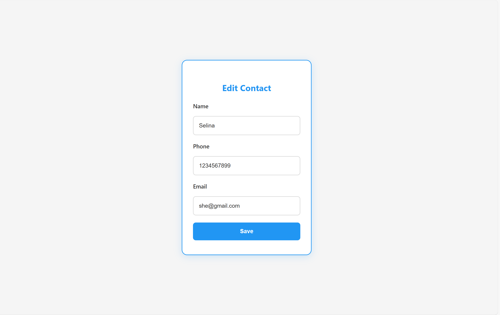

# Contact Book App

A simple contact management web application built with Flask.  
It supports user registration, login/logout, and CRUD operations for contacts. 

---

## Features

- User registration and login system with secure password hashing  
- Add, edit, delete contacts (each user manages their own contacts)  
- User authentication to protect routes and user data  
- SQLite database backend via SQLAlchemy ORM  
- Flash messages for user feedback  
- Basic Bootstrap-based UI 

---

## Technologies Used

- Python 3  
- Flask  
- Flask-SQLAlchemy  
- Flask-Login  
- Werkzeug (for password hashing)  
- SQLite

---

## Setup and Installation

1. Clone the repo:  
   ```bash
   git clone https://github.com/Kaur7611/contact-book.git
   cd contact-book

## Screenshots

### Homepage


### Add Contact


### Login Page


### Edit Contact




